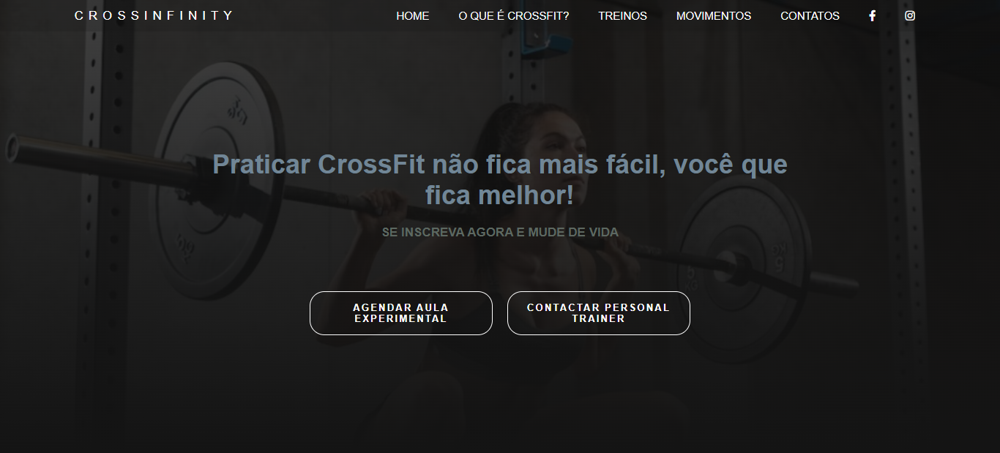

<h1 align="center">
   LandigPage Crossfit
</h1>
Esta é a criação de uma landingpage ficticia para um crossfit.
Nele foram abordados conceitos de HTML e CSS, questões sobre hover, posicionamento, centralização de itens, inclusão de imagens no background entre outros.
Permite se ter uma ideia sobre a criação de landingpages para aplicar em projetos reais.

## 💼 Tecnologias utilizadas

Para o desenvolvimento deste site utilizei as seguintes tecnologias:

- HTML;
- CSS;
- GIT e Github
